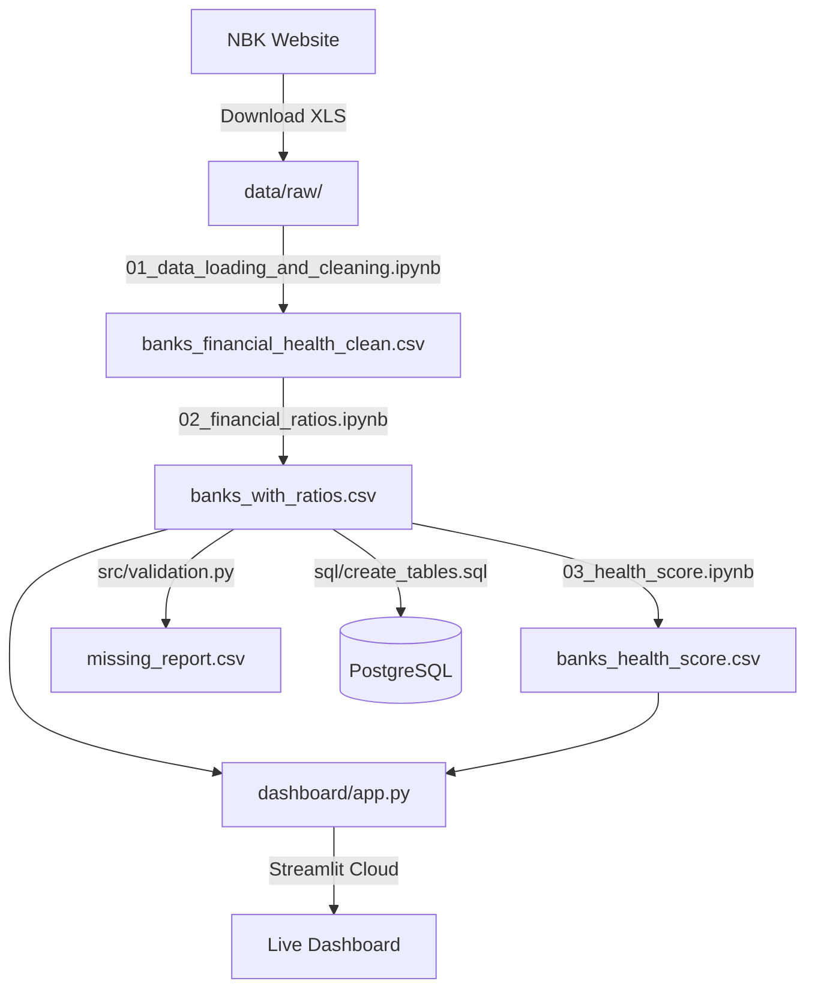
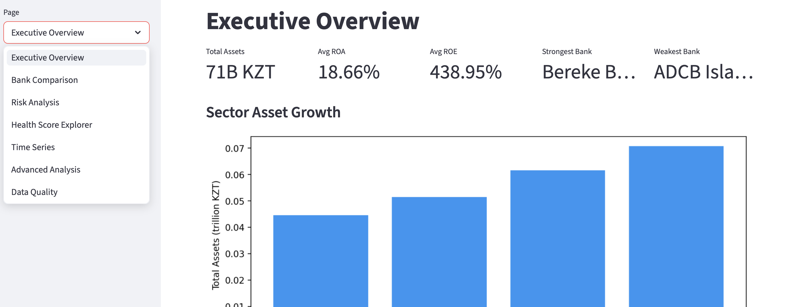
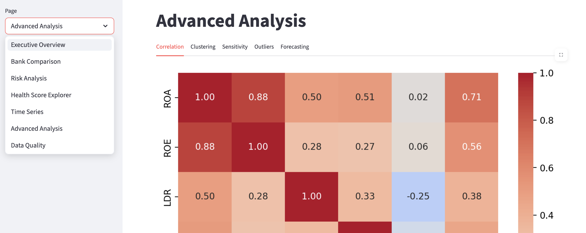

# Financial Health Analysis of Kazakhstan Banks


## Live Demo
👉 [Open Dashboard](https://kazakhstan-banks-financial-health-nzbooan9upudnqtbntwwan.streamlit.app/)

---

## Business Problem

How financially stable are Kazakhstan's second-tier banks between 2023–2026?
The banking sector plays a critical role in Kazakhstan's economy, yet there is no
publicly available composite health scoring model for retail or analytical use.
This project fills that gap using publicly available NBK data.

---

## Analytical Objectives

- Identify the strongest and weakest banks by profitability and capital strength
- Detect financially unstable or declining institutions
- Compare operational efficiency across banks of different sizes
- Build a composite Financial Health Score with sensitivity analysis

---

## Methodology

### Financial Ratios
| Metric | Formula | Interpretation |
|--------|---------|----------------|
| ROA | Net Income / Assets | Profitability per unit of assets |
| ROE | Net Income / Equity | Return on shareholders' capital |
| LDR | Loans / Deposits | Liquidity and lending aggressiveness |
| EAR | Equity / Assets | Capital adequacy buffer |

### Financial Health Score
Each metric is normalized using Min-Max scaling to [0, 1].
LDR is scored as `1 - abs(LDR - 1) / max(LDR)` — penalizes deviation from 1.0.

**Weights:**
| Metric | Weight | Rationale |
|--------|--------|-----------|
| ROA | 35% | Core profitability signal |
| ROE | 35% | Shareholder value creation |
| LDR | 15% | Liquidity risk proxy |
| EAR | 15% | Capital strength |

**Categories:**
| Score | Category |
|-------|----------|
| 0.00 – 0.35 | 🔴 Weak |
| 0.35 – 0.60 | 🟡 Moderate |
| 0.60 – 1.00 | 🟢 Strong |

### Assumptions & Limitations
- Data covers only 4 annual snapshots (2023–2026)
- Weights are expert-assigned, not statistically derived
- Financial consistency check revealed column mapping issues in 2025–2026 NBK files
- This is not an official rating or investment recommendation

---

## Architecture



---

## Business Questions & Answers

**1. Fastest asset growth (2023–2026)**
- Shinhan Bank Kazakhstan: +478%
- ICBC in Almaty: +112%
- Bank CenterCredit: +97%

**2. Most profitable banks**
- Kaspi Bank: ROA 7.1%, ROE 66% — most profitable large bank
- Citibank Kazakhstan: ROA 7.5% — high efficiency due to niche model
- Halyk Bank: ROA 3.9% — largest bank, stable profitability

**3. Highest loan-to-deposit ratio**
- Bank RBK: LDR 2.04 — lending twice its deposit base
- ForteBank: LDR 1.64
- Halyk Bank: LDR 1.57

**4. Strongest capital positions**
- Al-Hilal Islamic Bank: EAR 34%
- First Heartland Jusan Bank: EAR 18%
- Halyk Bank: EAR 13.6%

**5. Financial Health Score ranking**
- No bank reached Strong category (> 0.60)
- Top: Bereke Bank JSC (SB of Lesha Bank): 0.50
- Monte Carlo sensitivity shows rankings are volatile — weights matter significantly

---

## Key Insights

**Operational efficiency:** Small foreign-owned banks (ICBC, Citibank, Shinhan)
show significantly higher ROA than large domestic banks due to niche business models
and lower overhead. Size does not correlate with profitability (r = 0.02).

**Leverage structure:** Several banks maintain LDR above 2.0, meaning they fund
loans through interbank borrowing rather than customer deposits. This creates
refinancing risk in stress scenarios.

**Capital adequacy:** EAR varies from near-zero (Citibank) to 34% (Al-Hilal).
Banks with low EAR have less buffer to absorb unexpected losses.

**Risk exposure:** Bereke Bank and VTB posted losses in 2023 but recovered by 2024,
suggesting successful restructuring. Their rankings remain volatile under
Monte Carlo simulation.

---

## Business Recommendations

- **Monitor aggressive growth banks** — Shinhan (+478%) and ICBC (+112%) grew
  extremely fast. Rapid asset growth without proportional equity increase raises
  capital adequacy concerns.
- **Review liquidity structure** — Banks with LDR > 2.0 should be watched for
  funding concentration risk, especially in rising rate environments.
- **Track capital adequacy deterioration** — Several banks have EAR below 8%,
  which is considered a minimum buffer in stress scenarios.
- **Revisit Health Score weights** — Monte Carlo analysis shows rankings are
  sensitive to weight assumptions. A statistically derived weighting (PCA-based)
  would improve model robustness.

---

## Tools Used
Python, Pandas, NumPy, Matplotlib, Seaborn, Scikit-learn, Jupyter Notebook,
PostgreSQL, Streamlit, GitHub Actions

## Data Source
National Bank of Kazakhstan: https://nationalbank.kz/en/news/banks-performance

---

## Dashboard Preview





---

## How to Run

1. Clone the repository:
```bash
git clone https://github.com/zhflux/kazakhstan-banks-financial-health.git
cd kazakhstan-banks-financial-health
```

2. Install dependencies:
```bash
pip install -r requirements.txt
```

3. Download NBK Excel files and place in `data/raw/`

4. Run the pipeline:
```bash
python run_pipeline.py
```

5. Run the dashboard:
```bash
cd dashboard
streamlit run app.py
```