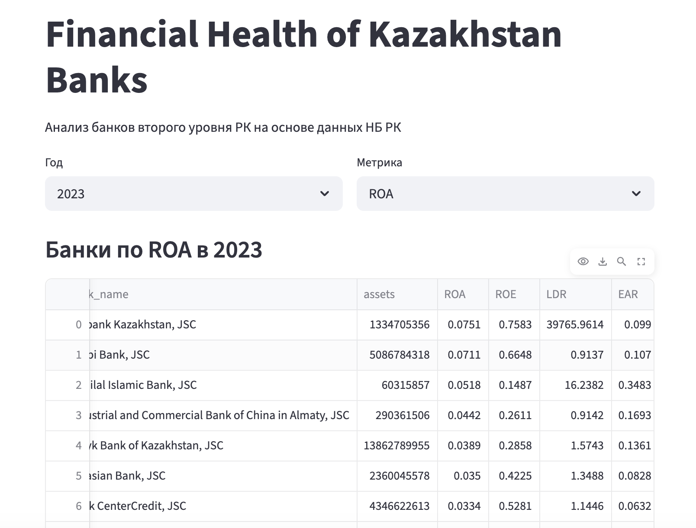
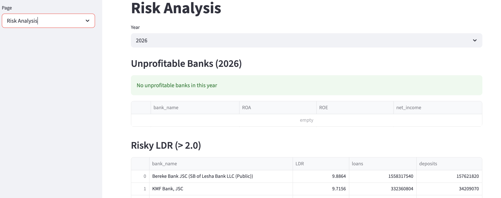
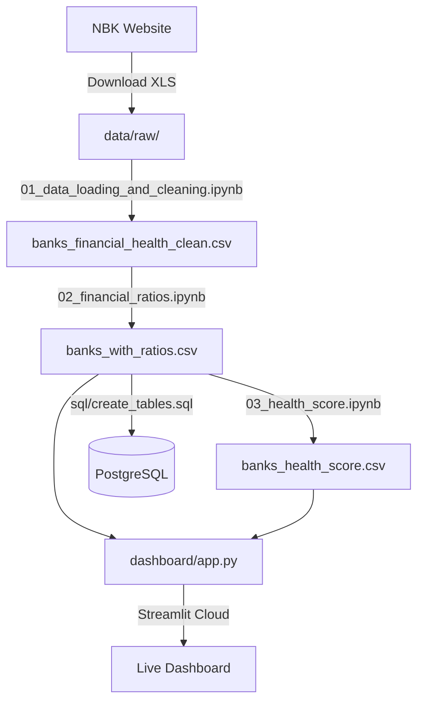

# Financial Health Analysis of Kazakhstan Banks

## Live Demo
👉 [Open Dashboard](https://kazakhstan-banks-financial-health-nzbooan9upudnqtbntwwan.streamlit.app/)

## Project Overview
This project analyzes the financial health of Kazakhstan's second-tier banks using publicly available financial data from the National Bank of Kazakhstan (NBK).

## Business Questions
1. Which Kazakhstan banks have shown the fastest asset growth?
2. Which banks are the most profitable based on ROA and ROE?
3. Which banks have a higher loan-to-deposit ratio?
4. Which banks have stronger capital positions?
5. Which banks appear financially stronger based on a combined scoring model?

## Answers

**1. Fastest asset growth (2023-2026):**
- Shinhan Bank Kazakhstan: +478%
- ICBC in Almaty: +112%
- Bank CenterCredit: +97%

**2. Most profitable banks:**
- Kaspi Bank: ROA 7.1%, ROE 66% — лидер по прибыльности
- Citibank Kazakhstan: ROA 7.5% — высокая эффективность за счёт нишевой модели
- Halyk Bank: ROA 3.9% — крупнейший банк со стабильной прибыльностью

**3. Highest loan-to-deposit ratio:**
- Bank RBK: LDR 2.04 — выдаёт кредитов вдвое больше депозитов
- ForteBank: LDR 1.64
- Halyk Bank: LDR 1.57

**4. Strongest capital positions:**
- Al-Hilal Islamic Bank: EAR 34% — самый капитализированный
- First Heartland Jusan Bank: EAR 18%
- Halyk Bank: EAR 13.6%

**5. Financial Health Score ranking:**
- Bereke Bank (SB of Lesha Bank): 0.50 — Moderate
- Islamic bank Zaman-Bank: 0.48 — Moderate
- ICBC in Almaty: 0.46 — Moderate
- Ни один банк не достиг категории Strong (>0.60)

## Current Status
- [x] Project structure created
- [x] Data source identified (NBK)
- [x] Raw NBK Excel files added (2023-2026)
- [x] Data loading and cleaning notebook
- [x] Financial ratios calculated (ROA, ROE, LDR, EAR)
- [x] Financial Health Score completed
- [x] SQL analysis queries added
- [x] Streamlit dashboard completed
- [x] Final report completed

## Tools Used
Python, Pandas, NumPy, Matplotlib, Seaborn, Jupyter Notebook, PostgreSQL, Streamlit

## Key Findings
- Shinhan Bank: fastest growth +478% (2023-2026)
- Kaspi Bank: most profitable (ROA 7.1%)
- Bereke Bank & VTB: losses in 2023, recovered by 2024

## Data Source
National Bank of Kazakhstan: https://nationalbank.kz/en/news/banks-performance

## Dashboard Preview





## Data Flow



## How to Run

1. Clone the repository:
```bash
git clone https://github.com/zhflux/kazakhstan-banks-financial-health.git
cd kazakhstan-banks-financial-health
```

2. Install dependencies:
```bash
pip install -r requirements.txt
```

3. Download NBK Excel files from:

https://nationalbank.kz/en/news/banks-performance

Put them in `data/raw/` named as `nbk_2023_capital_assets.xls` etc.

4. Run notebooks in order:
```bash
notebooks/01_data_loading_and_cleaning.ipynb
notebooks/02_financial_ratios.ipynb
notebooks/03_health_score.ipynb
```

5. Run the dashboard:
```bash
cd dashboard
streamlit run app.py
```

6. (Optional) Load data into PostgreSQL:
```bash
psql -d kazakhstan_banks -f sql/create_tables.sql
psql -d kazakhstan_banks -c "\copy banks(...) FROM 'data/processed/banks_with_ratios.csv' CSV HEADER"
```